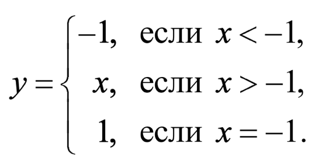
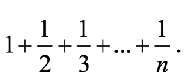
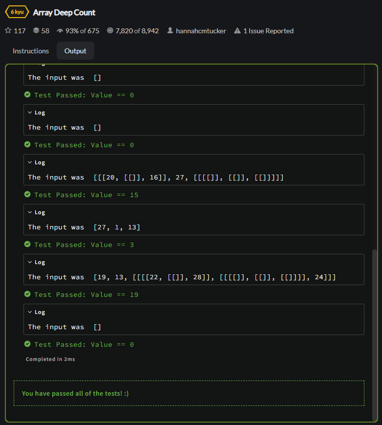
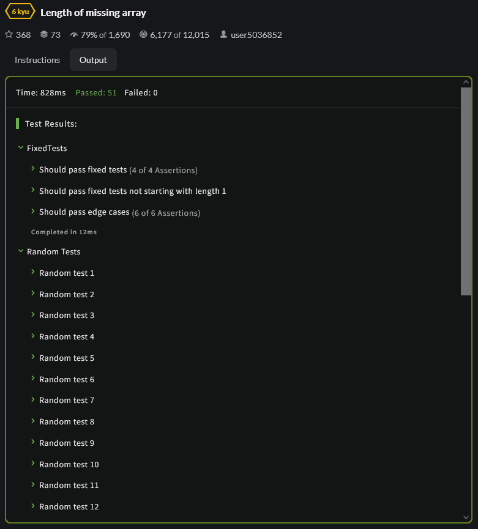
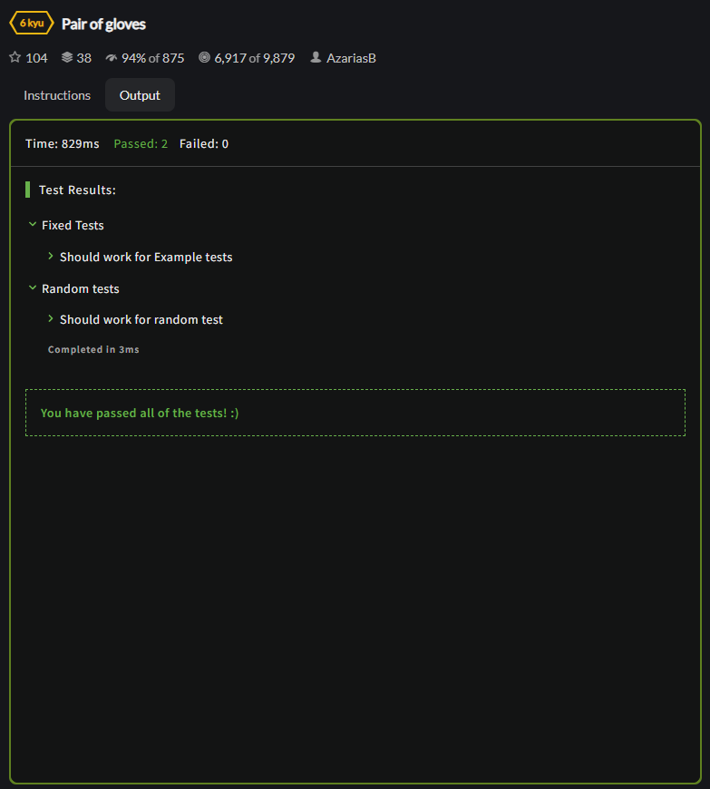
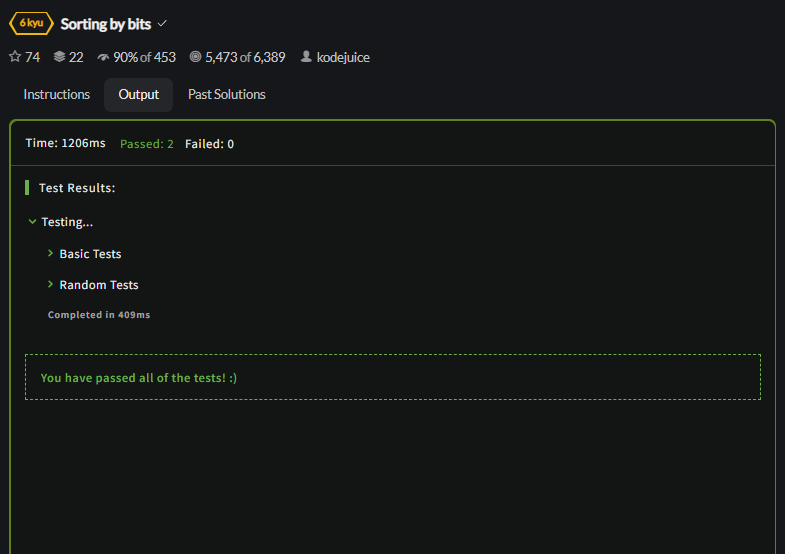
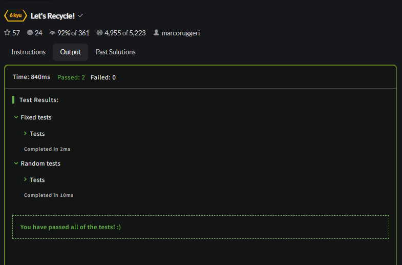

<p align = "center">МИНИСТЕРСТВО НАУКИ И ВЫСШЕГО ОБРАЗОВАНИЯ
РОССИЙСКОЙ ФЕДЕРАЦИИ
ФЕДЕРАЛЬНОЕ ГОСУДАРСТВЕННОЕ БЮДЖЕТНОЕ
ОБРАЗОВАТЕЛЬНОЕ УЧРЕЖДЕНИЕ ВЫСШЕГО ОБРАЗОВАНИЯ
«САХАЛИНСКИЙ ГОСУДАРСТВЕННЫЙ УНИВЕРСИТЕТ»</p>
<br><br><br><br><br><br>
<p align = "center">Институт естественных наук и техносферной безопасности<br>Кафедра информатики<br>Хроменков Владимир Александрович</p>
<br><br><br>
<p align = "center">Лабораторная работа №4<br>«Основы языка <strong>JavaScript</strong>»<br>01.03.02 Прикладная математика и информатика</p>
<br><br><br><br><br><br><br><br><br><br><br><br>
<p align = "right">Научный руководитель<br>
Соболев Евгений Игоревич</p>
<br><br><br>
<p align = "center">г. Южно-Сахалинск<br>2022 г.</p>

***
# <p align = "center">Оглавление</p>
- [Цели и задачи](#цели-и-задачи)
- [Решение задач](#решение-задач)
    - [HTML](#html)
    - [JavaScript](#javascript)
    - [Codewars](#codewars)
- [Вывод](#вывод)

***

# <p align = "center">Цели и задачи</p>

1.  Рассчитать значение `у` при заданном значении `х`

    <p align = "center">
    
    </p>
 
2.	Дано натуральное число `n` (`n <= 9999`). Выяснить, является ли оно палиндромом
("перевертышем") с учетом четырех цифр, как, например, числа `7777`, `8338`, `0330` и т. п. (Палиндромом называется число, десятичная запись которого читается одинаково слева направо и справа налево.)

3.	Год является високосным, если его номер кратен 4, однако из кратных 100 високосными являются лишь кратные 400, например, 1700, 1800 и 1900 — невисокосные года, 2000 — високосный.  
Дано натуральное число `n`. Определить, является ли високосным год с таким номером.

4.	Составить программу для вычисления значения функции `y(x)`:

    <p align = "center">
    
    </p>
 
5.	Составить программу, которая в зависимости от порядкового номера дня месяца (1, 2, ..., 12) выводит на экран время года, к которому относится этот месяц.

6.	Мастям игральных карт условно присвоены следующие порядковые номера: масти "пики" — 1, масти "трефы" — 2, масти "бубны" — 3, масти "червы" — 4, а достоинству карт: "валету" — 11, "даме" — 12, "королю" — 13, "тузу" — 14 (порядковые номера карт остальных достоинств соответствуют их названиям: "шестерка", "девятка" и т. п.). По заданным номеру масти `m` (1 m 4) и номеру достоинства карты `k` (6 k 14) определить полное название (масть и достоинство) соответствующей карты в виде `"Дама пик"`, `"Шестерка бубен"` и т. п.

7.	В некоторых странах Дальнего Востока (Китае, Японии и др.) использовался (и неофициально используется в настоящее время) календарь, отличающийся от применяемого нами. Этот календарь представляет собой 60-летнюю циклическую систему. Каждый 60-летний цикл состоит из пяти 12-летних подциклов. В каждом подцикле года носят названия животных: Крыса, Корова, Тигр, Заяц, Дракон, Змея, Лошадь, Овца, Обезьяна, Петух, Собака и Свинья. Кроме того, в названии года фигурируют цвета животных, которые связаны с пятью элементами природы — Деревом (зеленый), Огнем (красный), Землей (желтый), Металлом (белый) и Водой (черный). В результате каждое животное (и его год) имеет символический цвет, причем цвет этот часто совершенно не совпадает с его "естественной" окраской — Тигр может быть черным, Свинья — красной, а Лошадь — зеленой. Например, 1984 год — год начала очередного цикла — назывался годом Зеленой Крысы. Каждый цвет в цикле (начиная с зеленого) "действует" два года, поэтому через каждые 60 лет имя года (животное и его цвет) повторяется. Составить программу, которая по заданному номеру года нашей эры n печатает его название по описанному календарю в виде: "Крыса, Зеленый".  
Рассмотреть два случая: а) значение `n = 1984`; б) значение `n` может быть любым натуральным числом.

8.	Напечатать таблицу умножения на `9`.

9.	Напечатать "столбиком" значения `sin 2` , `sin 3` , ..., `sin 20` .

10.	Найти: а) сумму всех целых чисел от `100` до `500`; б) сумму всех целых чисел от `a` до `500` (значение `a` вводится с клавиатуры; `a <= 500`); в) сумму всех целых чисел от `–10` до `b` (значение `b` вводится с клавиатуры; `b => –10`); г) сумму всех целых чисел от `a` до `b` (значения `a` и `b` вводятся с клавиатуры; `b => a`).

11.	Вычислить сумму

    <p align = "center">
    
    </p> 

12.	Даны натуральные числа `х` и `у`. Вычислить `произведение` `x` и `y`, используя лишь операцию `сложения`. Задачу решить двумя способами.

13.	Составить программу возведения натурального числа в квадрат, учитывая следующую закономерность

    <p align = "center">
    
    </p>

14.	Вычислить сумму
 
    <p align = "center">
    
    </p>

15.	Дана непустая последовательность целых чисел, оканчивающаяся нулем. Найти: а) сумму всех чисел последовательности; б) количество всех чисел последовательности.

16.	Дана непустая последовательность неотрицательных целых чисел, оканчивающаяся отрицательным числом. Найти среднее арифметическое всех чисел последовательности (без учета отрицательного числа).

17.	Дано натуральное число. Определить: а) количество цифр `3` в нем; б) сколько раз в нем встречается последняя цифра; в) количество четных цифр в нем. Составное условие и более одного неполного условного оператора не использовать; г) сумму его цифр, больших пяти; д) произведение его цифр, больших семи; е) сколько раз в нем встречаются цифры `0` и `5` (всего).

18.	Дано натуральное число, в котором все цифры различны. Определить: а) порядковый номер его максимальной цифры, считая номера: от конца числа; от начала числа; б) порядковый номер его минимальной цифры, считая номера: от конца числа; от начала числа.
19.	Дано натуральное число. Выяснить, является ли оно простым (простым называется натуральное число, большее `1`, не имеющее других делителей, кроме единицы и самого себя). Оператор цикла с параметром не использовать.

20.	Дано натуральное число. Установить, является ли последовательность его цифр при просмотре их слева направо упорядоченной по возрастанию. Например, для числа `1478` ответ положительный, для чисел `1782` и `1668` — отрицательный и т. п.

21.	Дана непустая и упорядоченная по возрастанию последовательность целых чисел, оканчивающаяся числом `10 000`. Определить порядковый номер первого числа, большего заданного `n`. Если таких чисел в последовательности нет, то на экран должно быть выведено соответствующее сообщение.

22.	Дано натуральное число. Верно ли, что цифра `a` встречается в нем реже, чем цифра `b`?

23.	Имеется фрагмент программы в виде оператора цикла с параметром, обеспечивающий вывод на экран "столбиком" всех целых чисел от `10` до `30`. Оформить этот фрагмент в виде: а) оператора цикла с предусловием; б) оператора цикла с постусловием.

## [Codewars](https://www.codewars.com)

24.	[Head, Tail, Init and Last](https://www.codewars.com/kata/head-tail-init-and-last)

25.	[Array Deep Count](https://www.codewars.com/kata/array-deep-count)

26.	[Length of missing array](https://www.codewars.com/kata/length-of-missing-array)

27.	[Pair of gloves](https://www.codewars.com/kata/pair-of-gloves)

28.	[Sorting by bits](https://www.codewars.com/kata/sorting-by-bits)

29.	[Let's Recycle!](https://www.codewars.com/kata/lets-recycle)

***

# <p align = "center">Решение задач</p>

## HTML

```html
<!DOCTYPE html>
<html lang="ru">
    <head>
        <meta charset="utf-8" />
        <title>Лабораторная 4</title>
    </head>
    <body>
        <script>
            document.addEventListener("DOMContentLoaded", function(){
                PageConstuct();
            });
        </script>
        
        <h2>Задание 1</h2>
        <div id="insert-1"></div><br>

        <h2>Задание 2</h2>
        <div id="insert-2"></div><br>

        <h2>Задание 3</h2>
        <div id="insert-3"></div><br>

        <h2>Задание 4</h2>
        <div id="insert-4"></div><br>

        <h2>Задание 5</h2>
        <div id="insert-5"></div><br>

        <h2>Задание 6</h2>
        <div id="insert-6"></div><br>

        <h2>Задание 7</h2>
        <div id="insert-7"></div><br>

        <h2>Задание 8</h2>
        <div id="insert-8"></div><br>

        <h2>Задание 9</h2>
        <div id="insert-9"></div><br>

        <h2>Задание 10</h2>
        <div id="insert-10"></div><br>

        <h2>Задание 11</h2>
        <div id="insert-11"></div><br>

        <h2>Задание 12</h2>
        <div id="insert-12"></div><br>

        <h2>Задание 13</h2>
        <div id="insert-13"></div><br>

        <h2>Задание 14</h2>
        <div id="insert-14"></div><br>

        <h2>Задание 15</h2>
        <div id="insert-15"></div><br>

        <h2>Задание 16</h2>
        <div id="insert-16"></div><br>

        <h2>Задание 17</h2>
        <div id="insert-17"></div><br>

        <h2>Задание 18</h2>
        <div id="insert-18"></div><br>

        <h2>Задание 19</h2>
        <div id="insert-19"></div><br>

        <h2>Задание 20</h2>
        <div id="insert-20"></div><br>

        <h2>Задание 21</h2>
        <div id="insert-21"></div><br>

        <h2>Задание 22</h2>
        <div id="insert-22"></div><br>

        <h2>Задание 23</h2>
        <div id="insert-23"></div><br>

        <script src="index.js"></script>   
    </body>
</html>
```

## JavaScript

```js
function PageConstuct(){
    appendInPage("insert-1", "y(2) = " + zad1(2));
    appendInPage("insert-1", "y(-3) = " + zad1(-3));

    appendInPage("insert-2", zad2(1223));
    appendInPage("insert-2", zad2(6996));

    appendInPage("insert-3", zad3(2000));
    appendInPage("insert-3", zad3(2023));

    appendInPage("insert-4", "y(-2) = " + zad4(-2));
    appendInPage("insert-4", "y(-0.6) = " + zad4(-0.6));
    appendInPage("insert-4", "y(-1) = " + zad4(-1));

    appendInPage("insert-5", zad5(1));
    appendInPage("insert-5", zad5(5));
    appendInPage("insert-5", zad5(11));
    appendInPage("insert-5", zad5());

    appendInPage("insert-6", zad6(9, 2));
    appendInPage("insert-6", zad6(11, 3));
    appendInPage("insert-6", zad6(7, 1));

    appendInPage("insert-7", "1984: " + zad7(1984));
    appendInPage("insert-7", "2001: " + zad7(2001));

    appendInPage("insert-8", zad8());

    appendInPage("insert-9", zad9());

    appendInPage("insert-10", "a = 4;<br>b = 8;<br><br>" + zad10(4,8) + "<br>");
    appendInPage("insert-10", "a = 45;<br>b = 13;<br><br>" + zad10(45,13) + "<br>");

    appendInPage("insert-11", "n = 5: " + zad11(5));
    appendInPage("insert-11", "n = 18: " + zad11(18));

    appendInPage("insert-12", "a) (x,y) = (4,7): " + zad12_1(4,7));
    appendInPage("insert-12", "b) (x,y) = (4,7): " + zad12_2(4,7));

    appendInPage("insert-13", "3^2 = " + zad13(3));
    appendInPage("insert-13", "8^2 = " + zad13(8));
    appendInPage("insert-13", "10^2 = " + zad13(10));

    appendInPage("insert-14", zad14());

    appendInPage("insert-15", "Последовательность: " + [1,4,2,4,6,3]);
    let res = zad15([1,4,2,4,6,3]);
    appendInPage("insert-15", "a) " + res[0]);
    appendInPage("insert-15", "b) " + res[1]);

    appendInPage("insert-16", "Последовательность: " + [1,7,2,4,6,-1]);
    appendInPage("insert-16", "Среднее арифметическое: " + zad16([1,7,2,4,6,-1]));

    appendInPage("insert-17", "1234: <br>" + zad17(1234)+"<br>");
    appendInPage("insert-17", "895710533: <br>" + zad17(895710533));

    appendInPage("insert-18", "Введенное число: 50291");
    appendInPage("insert-18", zad18(50291));

    appendInPage("insert-19", zad19(1));
    appendInPage("insert-19", zad19(4));
    appendInPage("insert-19", zad19(7));
    appendInPage("insert-19", zad19(17));
    appendInPage("insert-19", zad19(18));

    appendInPage("insert-20", zad20(1478));
    appendInPage("insert-20", zad20(1557));
    appendInPage("insert-20", zad20(1648));

    appendInPage("insert-21", zad21([1,4,6,8,12,17], 16));
    appendInPage("insert-21", zad21([1,4,6,8,12,17,18,28,45,67], 16));
    appendInPage("insert-21", zad21([1,4,6,8,12], 12));

    appendInPage("insert-22", zad22(11222, 1, 2));
    appendInPage("insert-22", zad22(111222, 1, 2));
    appendInPage("insert-22", zad22(11122, 1, 2));

    appendInPage("insert-23", zad23());
}

function appendInPage(where, that, isBr = true){
    if(isBr) document.getElementById(where).innerHTML += that + "<br>";
    else document.getElementById(where).innerHTML += that;
}

function zad1(x) {
    if (x > 0)
        return Math.sin(x) ** 2;

    return 1 - 2 * Math.sin(x) ** 2;
}

function zad2(n) {
    if (n <= 0 || n > 9999)
        return "n должно быть натуральным"

    const num = n.toString().split('');

    for (let i = 0, j = num.length - 1; i < j; i++, j--) {
        if (num[i] != num[j]) {

            return `${n} - не палиндром`;
        }
    }

    return `${n} - палиндром`;
}

function zad3(year) {
    if (year % 4 == 0)
        if (year % 100 != 0)
            return `${year} - високосный год`;
        else if (year % 400 == 0)
            return `${year} - високосный год`;

    return `${year} - невисокосный год`;
}

function zad4(x) {
    if (x < - 1) return -1;
    if (x > - 1) return x;
    if (x == - 1) return 1;
}

function zad5(m) {

    const Winter = () => "Зима";
    const Spring = () => "Весна";
    const Summer = () => "Лето";
    const Fall = () => "Осень";

    const months = {
        12: Winter(),
        1: Winter(),
        2: Winter(),
        3: Spring(),
        4: Spring(),
        5: Spring(),
        6: Summer(),
        7: Summer(),
        8: Summer(),
        9: Fall(),
        10: Fall(),
        11: Fall(),
        'default': 'Неизвестный месяц',
    }

    let month = (months[m] || months['default'])
    return month;
}

function zad6(m, k) {

    const Cards = {
        6: 'Шестерка',
        7: 'Семерка',
        8: 'Восьмерка',
        9: 'Девятка',
        10: 'Десятка',
        11: 'Валет',
        12: 'Дама',
        13: 'Король',
        14: 'Туз',
    }

    const Suits = {
        1: 'пик ♠',
        2: 'треф ♣',
        3: 'бубен ♦',
        4: 'червей ♥',
    }

    let card = Cards[m] ?? 'Неизвестная карта';
    let suit = Suits[k] ?? 'неизвестной масти';

    return card + " " + suit;
}

function zad7(n) {
    if (n <= 0)
        return "Неверный год";

    let animals = ["Крыса", "Бык", "Тигр", "Кролик", "Дракон", "Змея",
        "Лошадь", "Овца", "Обезьяна", "Петух", "Собака", "Свинья"];
    let colors = ["Белый", "Черный", "Зеленый", "Красный", "Желтый"];

    let res = "";
    n += 20;

    res += animals[n % 12] + ", ";
    res += colors[Math.floor((n % 10) / 2)];

    return res;
}

function zad8() {
    let res = "";

    for (let i = 1; i <= 10; i++) {
        res += `9 * ${i} = ${i*9}<br>`;
    }

    return res;
}

function zad9() {
    let res = "";
    for (let i = 2; i <= 20; i++) {
        res += `sin ${i} = ${Math.sin(i)}<br>`;
    }

    return res;
}

function zad10(a, b) {
    function sumOfAP(a, b) {
        return (a + b) / 2 * (b - a + 1); 
    }

    let A = sumOfAP(100, 500);
    let B = sumOfAP(a, 500);
    let C = sumOfAP(-10, b);
    let D = sumOfAP(a, b);

    return `a) ${A}<br>б) ${B}<br>в) ${C}<br>г) ${D}`;
}

function zad11(n) {
    let sum = 0;

    for (let i = 1; i <= n; i++) {
        sum += 1 / i;
    }

    return sum;
}

function zad12_1(x, y) {
    let sum = 0;

    for (let i = 0; i < y; i++) {
        sum += x;
    }

    return sum / 2;
}

function zad12_2(x, y) {
    let sum = 0;
    let i = 0;
    do {
        i++;
        sum += x;
    } while (i < y);

    return sum / 2;
}

function zad13(x) {
    return (2 + 2 * (x - 1)) / 2 * x;
}

function zad14() {
    let sum = 0;
    for (let i = 50; i >= 1; i--) {
        sum = Math.sqrt(sum + i);
    }

    return sum;
}

function zad15(n) {
    let sum = n.reduce((sum, x) => sum += x);
    let len = n.length;

    return [sum, len];
}

function zad16(n) {
    let sum = 0;

    for (let i = 0; i < n.length - 1; i++) {
        sum += n[i];
    }

    return sum / (n.length - 1)
}

function zad17(n) {
    n = n.toString().split('').map(Number);

    let A = n.reduce((total, elem) => {
        return (elem === 3 ? total + 1 : total)
    }, 0);

    let B = n.reduce((total, elem) => {
        return (elem === n[n.length - 1] ? total + 1 : total)
    }, 0);

    let C = n.reduce((total, elem) => {
        return (elem % 2 === 0 ? total + 1 : total)
    }, 0);

    let D = 0, E = 1;
    for (let i = 0; i < n.length; i++) {
        if (n[i] > 5) D+=n[i];
        if (n[i] > 7) E*=n[i];
    }

    let F = n.reduce((total, elem) => {
        return ((elem === 0 || elem === 5) ? total + 1 : total)
    }, 0);

    return `a) кол-во 3: ${A}<br>`+
           `б) кол-во повторений ${n[n.length - 1]}: ${B}<br>`+
           `в) кол-во четных: ${C}<br>`+
           `г) сумма цифр, больших 5: ${D}<br>`+
           `д) произведение цифр больших 7: ${E}<br>`+
           `е) кол-во повторений 0 и 5: ${F}`;
}

function zad18(n) {
    n = n.toString().split('').map(Number);

    let A = n.indexOf(Math.max.apply(null, n));
    let B = n.indexOf(Math.min.apply(null, n));

    return `a) порядковый номер максимальной цифры: ${A}<br>`+
           `б) порядковый номер минимальной цифры: ${B}<br>`;
}

function zad19(n) {
    let res = false;
    if (n == 1)
        return `${n} - является простым числом`;

    let del = 1;
    while (n % ++del != 0);

    res = del == n ? true : false;

    if (res) return `${n} - является простым числом`;
    else return `${n} - не является простым числом`;
}

function zad20(n) {
    let t = n;
    n = n.toString().split('').map(Number);

    let prev = -1;
    for (const elem of n) {
        if (elem > prev) {
            prev = elem;
        }
        else
            break;
    }

    if (prev == n[n.length - 1])
    return `${t} - цифры упорядочены`;

    return `${t} - цифры не упорядочены`;
}

function zad21(nums, n) {
    let idx = nums.findIndex(x => x > n);

    let res = idx != -1;
    return res ? `${nums} : ${idx} - первое число, которое больше ${n}` : `${nums} : не найдено число, больше ${n}`;
}

function zad22(n, a, b) {
    let t = n;
    n = n.toString().split('').map(Number);

    let countA = 0, countB = 0;

    n.forEach(element => {
        if (element === a) countA++;
        if (element === b) countB++;
    })

    let res = countA > countB;

    if (res) return `${t}: цифра ${a} встречается чаще, чем цифра ${b}`;
    else return `${t}: цифра ${b} встречается чаще, чем цифра ${a}`;
}

function zad23() {
    let start = 10;
    let end = 30;
    let A = "", B = "";
    while (start <= end) {
        A += start++ + " ";
    }

    start = 10;

    do {
        B += start + " ";
    } while (start++ < end);

    return `a) ${A}<br>`+
           `б) ${B}`;
}
```

## [Codewars](https://www.codewars.com) ([Profile Link](https://www.codewars.com/users/ZFGinc))

### Head, Tail, Init and Last

```js
function head(arr) { return arr[0]; }
function tail(arr) { return arr.slice(1); }
function init(arr) { return arr.slice(0, arr.length-1); }
function last(arr) { return arr[arr.length-1]; }
```

<p align = "center">

</p>

### [Array Deep Count](https://www.codewars.com/kata/array-deep-count)

```js
function deepCount(a){
  let sum = a.length;
  
  a.forEach(element => { if(Array.isArray(element)) sum += deepCount(element); });
  
  return sum
}
```

<p align = "center">

</p>

### [Length of missing array](https://www.codewars.com/kata/length-of-missing-array)

```js
function getLengthOfMissingArray(arrayOfArrays) {
  if (arrayOfArrays === null || arrayOfArrays.length === 0) {
    return 0
  }
  for(let i = 0; i < arrayOfArrays.length; i++) {
    if (arrayOfArrays[i] === null || arrayOfArrays[i].length === 0) return 0
  }
  arrayOfArrays.sort(function(a, b) {
    return a.length - b.length;
  })
  for(let i = 0; i < arrayOfArrays.length; i++) {
    if (arrayOfArrays[i].length + 1 !== arrayOfArrays[i + 1].length) {
      return arrayOfArrays[i].length + 1
    }
  }
}
```

<p align = "center">

</p>

### [Pair of gloves](https://www.codewars.com/kata/pair-of-gloves)

```js
let pairs = 0, counts = {};

    for (const glove of gloves) {
        if (isNaN(counts[glove])) counts[glove] = 0;

        if (++counts[glove] === 2) {
            counts[glove] -= 2;
            pairs++;
        }
    }
    
    return pairs;
```

<p align = "center">

</p>

### [Sorting by bits](https://www.codewars.com/kata/sorting-by-bits)

```js
function sortByBit(arr) {  
  arr.sort((a,b) => a.toString(2).replace(/0/g, '').length - b.toString(2).replace(/0/g, '').length || a-b);
  
  return arr;
}
```

<p align = "center">

</p>

### [Let's Recycle!](https://www.codewars.com/kata/lets-recycle)

```js
function recycle(arr) {
  let paper = [], glass = [], organic = [], plastic = [];

  arr.forEach(obj => {  
    if(obj.material === 'paper' || obj.secondMaterial === 'paper' ) paper.push(obj.type)
    if(obj.material === 'glass' || obj.secondMaterial === 'glass') glass.push(obj.type)
    if(obj.material === 'organic' || obj.secondMaterial === 'organic') organic.push(obj.type)
    if(obj.material === 'plastic' || obj.secondMaterial === 'plastic') plastic.push(obj.type)
  });

  return [paper, glass, organic, plastic]
}
```

<p align = "center">

</p>

***

# <p align = "center">Вывод</p>

Выполнил *лабораторную работу №4*, совершенствую навыки работы с языком `JavaScript`. Также продолжаю осваивать систему `git`.
